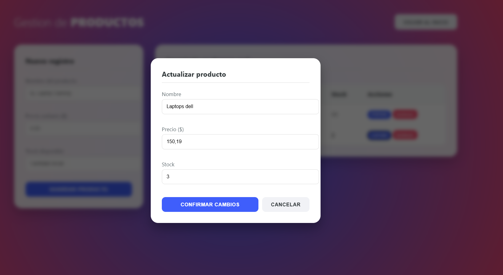
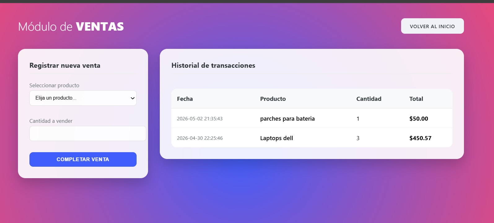

# ActividadIntegrardora2
----##Capturas del sistema

Descripcion del sistema
BASSKA System permite a pequeñas y medianas empresas gestionar su catálogo de productos de manera eficiente. El sistema ofrece una interfaz intuitiva para:
* **Control de stock:** Registro, edición y eliminación de productos.
* **Dashboard dinámico:** Visualización inmediata del total de productos y ganancias acumuladas.
* **Gestión de ventas:** Registro de transacciones con actualización automática de inventario.
* **Interfaz moderna:** Diseño basado en tarjetas y tablas limpias para una mejor experiencia de usuario.

---##Requisitos
Para ejecutar este proyecto localmente, asegurarse de tener instalado:
* **Servidor local:** [XAMPP](https://www.apachefriends.org/) (Apache y MySQL).
* **Lenguaje:** PHP 8.x o superior.
* **Base de datos:**MySQL.
* **Navegador:** Chrome, Edge o Firefox actualizado.

---Pasos para isntalacion

1. **Clonar o descargar el proyecto:**
   Coloca la carpeta del proyecto en la ruta `C:\xampp\htdocs\`.

2. **Configurar la base de datos:**
   * Abre **phpMyAdmin**.
   * Crea una nueva base de datos llamada `inventariov`.
   * Importa el archivo `database/inventario.sql` (o el script SQL que tengas en tu carpeta database).

3. **Configurar la Conexión:**
   Verifica que el archivo `config/database.php` tenga tus credenciales locales (normalmente usuario `root` y sin contraseña).

4. **Ejecutar:**
   Inicia apache y MySQL en XAMPP y accede desde tu navegador a:
   `http://localhost/ActividadIntegradora2/public/index.php`

---